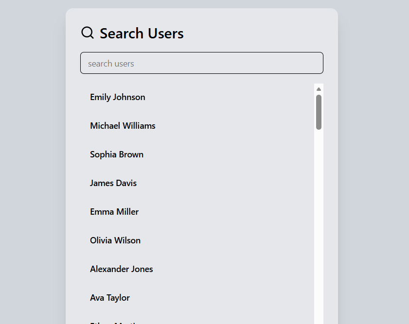

# 🔍 Search Autocomplete Component

A professional, high-performance search autocomplete feature built with **React 19**, **TypeScript**, and **Tailwind CSS**. This component fetches user data from an external API, provides real-time filtering, and ensures a seamless user experience with loading states and error handling.



## 🚀 Live Demo

Check out the live demo here: [Live Link](https://react-seacrh-autocomplete-feature.pages.dev/)

## ✨ Features

- ⚡ **Real-time Filtering**: Instantly filters results as you type.
- 🔄 **Fetch Optimization**: Uses `AbortController` to cancel pending requests on component unmount or rapid re-renders.
- 🎨 **Modern UI**: Styled with **Tailwind CSS** and **Shadcn UI** for a premium look and feel.
- 📱 **Fully Responsive**: Optimized for all screen sizes.
- 🛠️ **Type Safe**: Fully written in **TypeScript** for robust development.
- ⏳ **Loading & Error States**: Gracefully handles network delays and API failures.

## 🛠️ Built With

- **React 19**
- **TypeScript**
- **Tailwind CSS**
- **Lucide React** (Icons)
- **Shadcn UI** (Components)

## 🏁 Getting Started

### Prerequisites

- Node.js (Latest LTS recommended)
- npm or yarn

### Installation

1. **Clone the repository**:

   ```bash
   git clone https://github.com/yehiaaly/react-seacrh-autocomplete-feature.git
   ```

2. **Navigate to the project directory**:

   ```bash
   cd react-seacrh-autocomplete-feature
   ```

3. **Install dependencies**:

   ```bash
   npm install
   ```

4. **Run the development server**:
   ```bash
   npm run dev
   ```

## 📖 Documentation

### Usage Example

To use the `SearchAutoComplete` component in your project, simply import and render it:

```tsx
import SearchAutoComplete from "./components/search-autocomplete";

const App = () => {
  return (
    <div className="min-h-screen bg-gray-100 p-8">
      <SearchAutoComplete />
    </div>
  );
};

export default App;
```

### Project Structure

```text
src/
|   App.css
|   App.tsx
|   index.css
|   main.tsx
|
+---components
|   +---search-autocomplete
|   |       index.tsx
|   |
|   \---ui
|           button.tsx
|           card.tsx
|           input.tsx
|           item.tsx
|           separator.tsx
|           spinner.tsx
|
+---lib
|       utils.ts
|
\---types
        users.ts
```

---

Developed with ❤️ by [Yehia Aly](https://github.com/yehiaaly)
